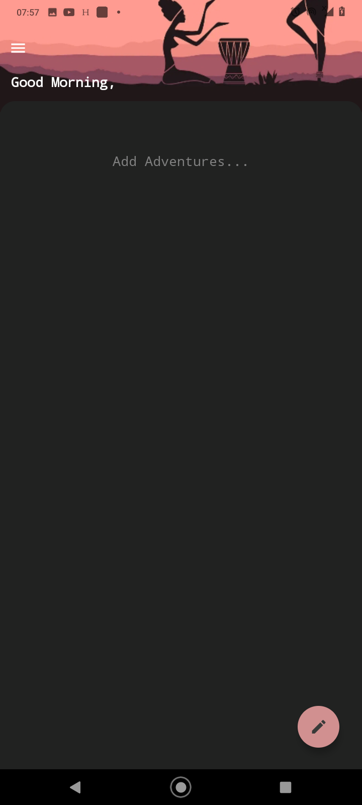
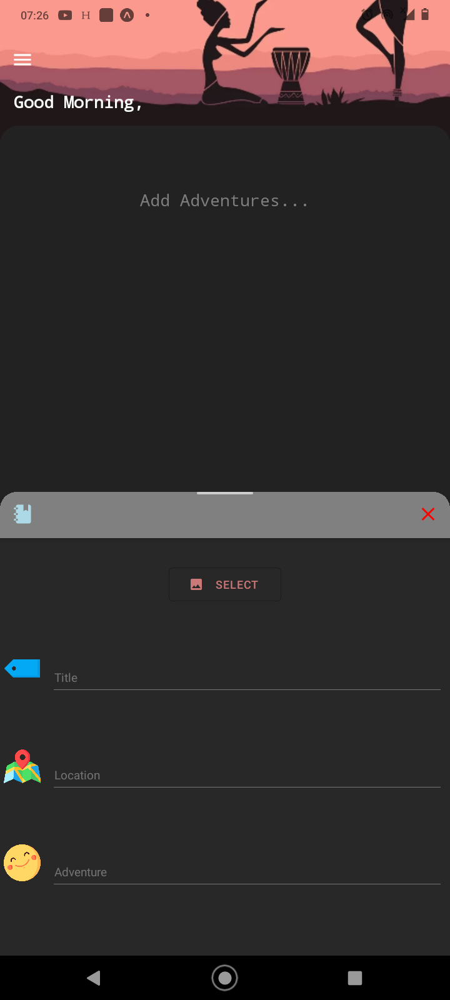
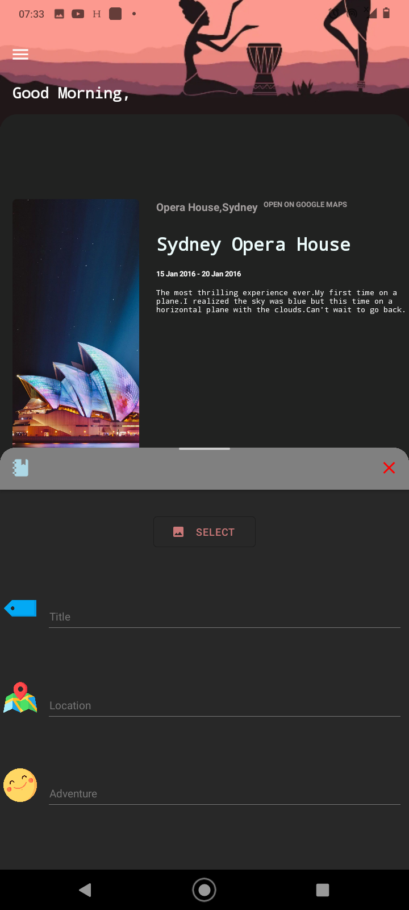
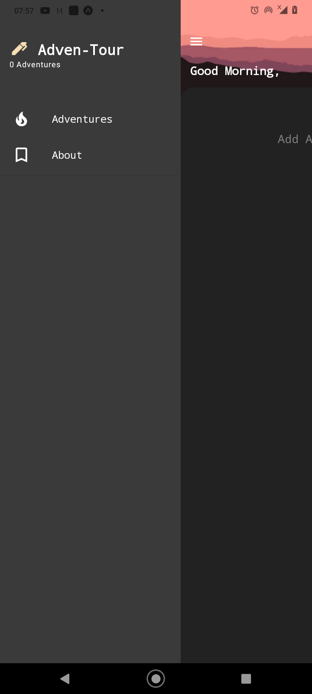

# Adven-Tour
> Travel journal Companion App

 

Cross-platform travel journal app for ios/android.Written in React-Native.

React-Native Android Travel app 

Final app will be for android.

Adven-tour v1.0.0

#### ScreenShots:
<table>
  <thread>
    <tr>
      <th align="center">Main Page</th>
      <th align="center">Add Journal</th>
      </tr>
  </thread>
 <tbody>
   <tr>
     <td aligin="center">
       
     </td>
          <td aligin="center">
       
     </td>
   </tr>
  </tbody>
        
  </table>
  <table>
  <thread>
    <tr>
      <th align="center">Added Journal</th>
      <th align="center">Side Menu</th>
      </tr>
  </thread>
 <tbody>
   <tr>
     <td aligin="center">
       
     </td>
          <td aligin="center">
       
     </td>
   </tr>
  </tbody>
        
  </table>


Usage : 

#### Clone the package
```git clone Adven-Tour ```


#### Install dependancies
```npm install``` 

#### Start App
```npm start ``` or ``` yarn start ``` 


